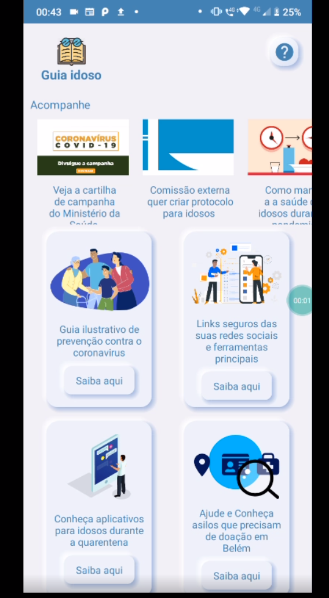
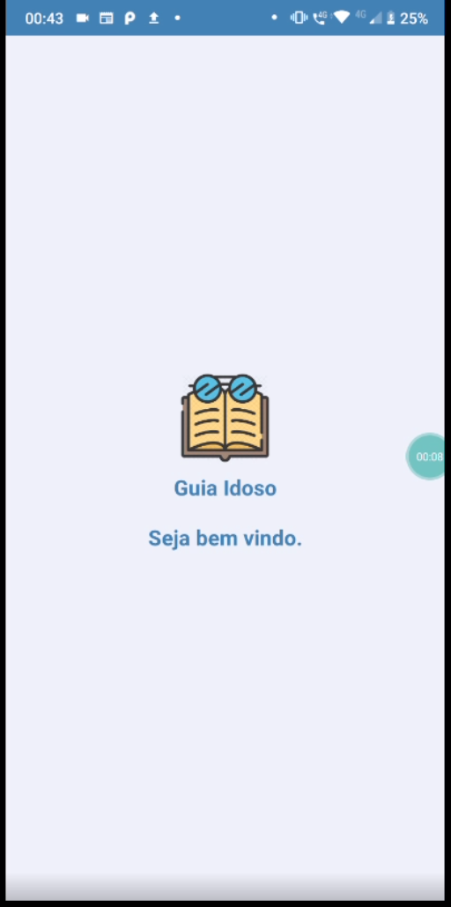
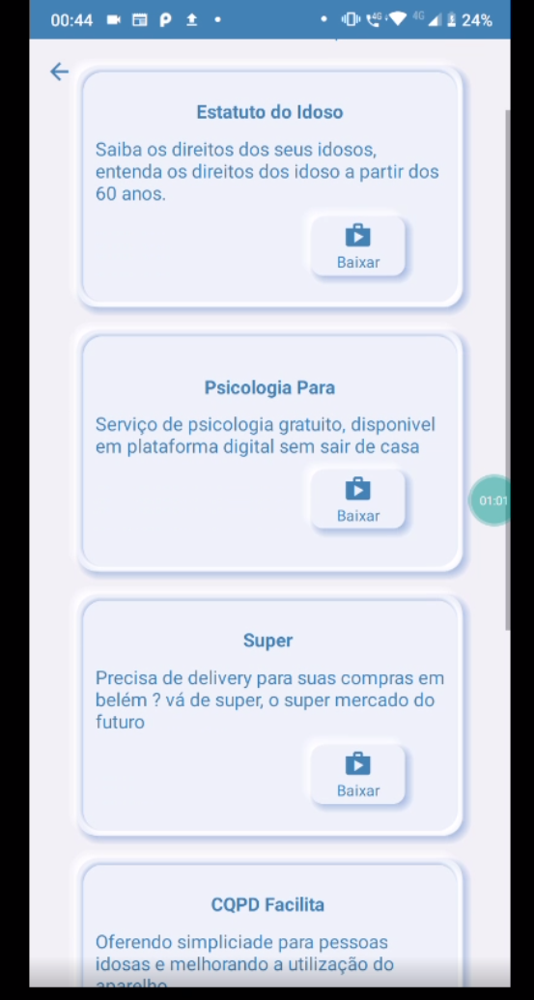

# Guia-Idoso

> Aplicativo canal de informações para responsaveis de idosos e idosos com foco durante a quarentena

### Features implementadas

seguintes ferramentas utilizadas:

- [x] UI Neomorfismo 
- [x] Links
- [x] Lottifiles

## Prints das telas

## 📝 Licença

Esse projeto está sob licença. Veja o arquivo [LICENÇA](LICENSE.md) para mais detalhes.

[⬆ Voltar ao topo](#nome-do-projeto) 
